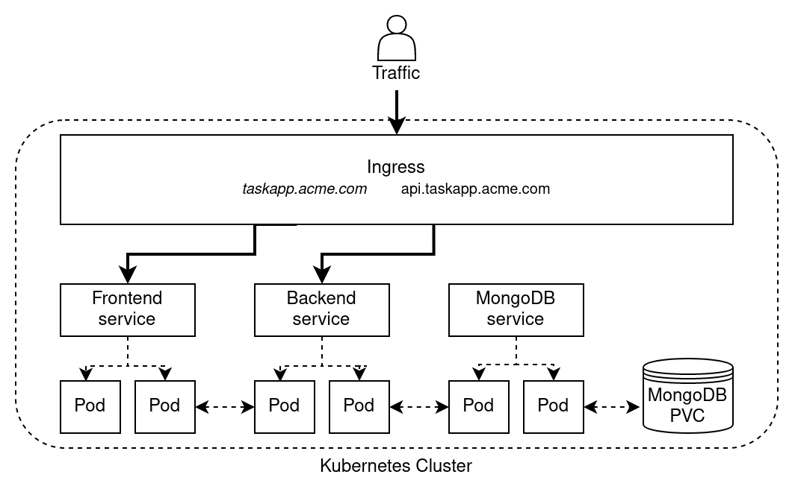
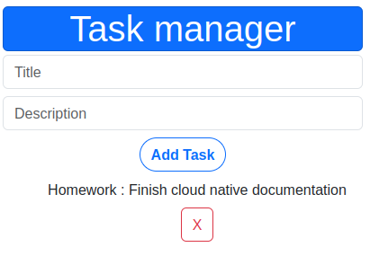
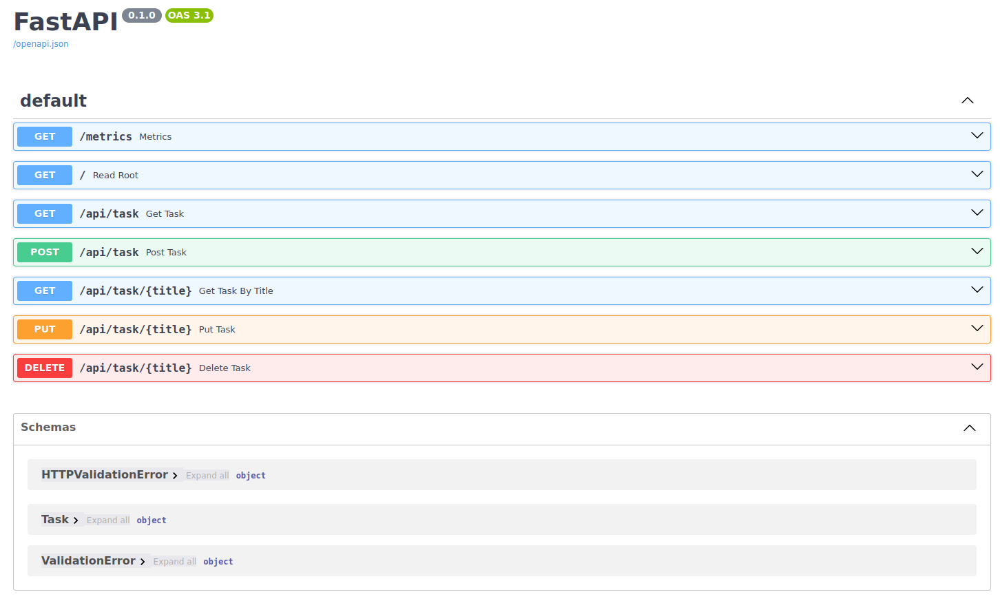
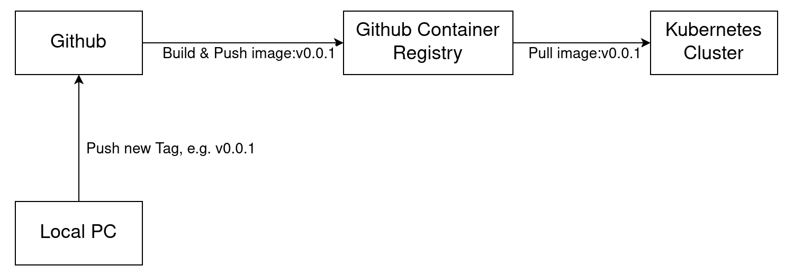
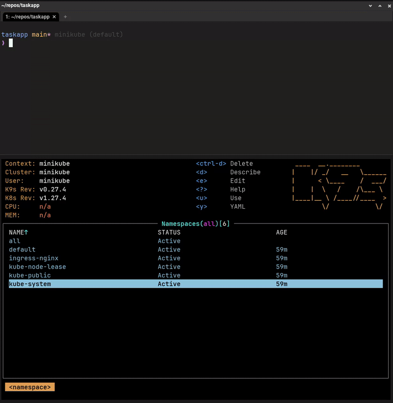
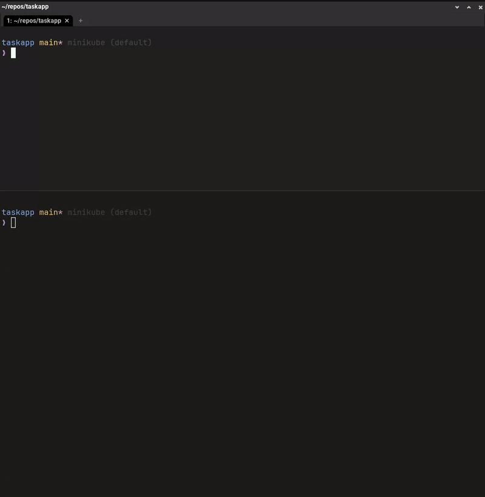
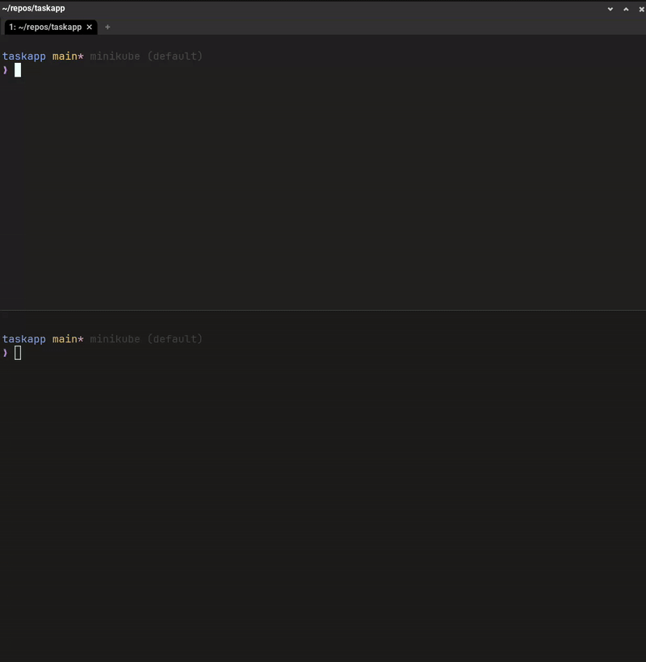
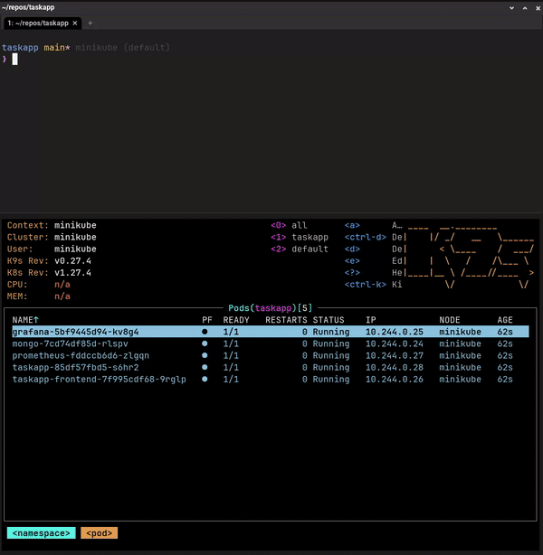
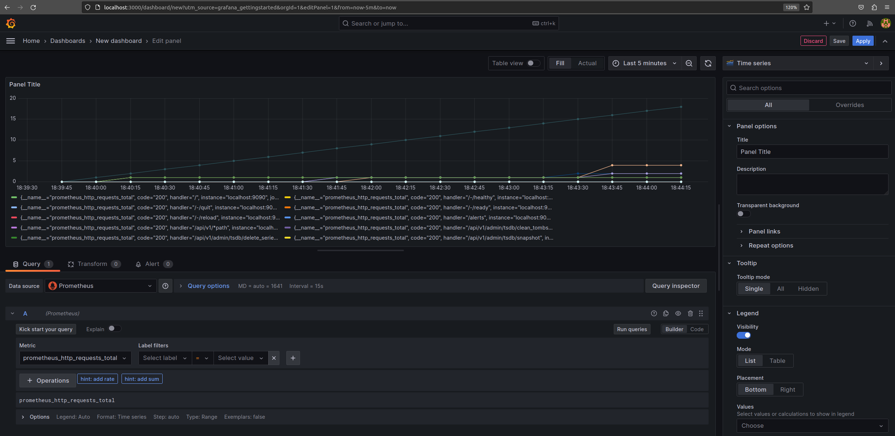

<style>
  .center {
  display: block;
  margin-left: auto;
  margin-right: auto;
}
</style>

# Cloud Native Task-Manager (Laborbericht)

**Name**: Daniel Stöcklein

**Matrikelnummer**: 2163680

**Modul**: W3M20035

**Professoren**: Prof. Dr.-Ing. habil. Dennis Pfisterer & Prof. Dr. Christoph Sturm

#  Inhaltsverzeichnis

<!-- vscode-markdown-toc -->
* 1. [Warum Cloud-Native? (Teil 1 Prof. Sturm)](#WarumCloud-NativeTeil1Prof.Sturm)
	* 1.1. [Einleitung](#Einleitung)
	* 1.2. [Vor- und Nachteile Cloud Native am Beispiel des Task-Managers](#Vor-undNachteileCloudNativeamBeispieldesTask-Managers)
	* 1.3. [Datensicherheit und DSGVO](#DatensicherheitundDSGVO)
	* 1.4. [Alternativen](#Alternativen)
* 2. [Entwicklung einer Cloud-Native Anwendung (Teil 2 Prof. Pfisterer)](#EntwicklungeinerCloud-NativeAnwendungTeil2Prof.Pfisterer)
	* 2.1. [Zielsetzung](#Zielsetzung)
	* 2.2. [Architektur](#Architektur)
		* 2.2.1. [Frontend](#Frontend)
		* 2.2.2. [Backend](#Backend)
		* 2.2.3. [Projektstruktur](#Projektstruktur)
	* 2.3. [Entwurf](#Entwurf)
		* 2.3.1. [Anwendung Lokal ausführen](#AnwendungLokalausfhren)
		* 2.3.2. [Anwendung in der Cloud ausführen (Hetzner-Cloud)](#AnwendunginderCloudausfhrenHetzner-Cloud)
		* 2.3.3. [Lokale Softwareentwicklung mit Tilt](#LokaleSoftwareentwicklungmitTilt)
		* 2.3.4. [Monitoring](#Monitoring)
	* 2.4. [Fazit zum Projekt und Ausblick](#FazitzumProjektundAusblick)

<!-- vscode-markdown-toc-config
	numbering=true
	autoSave=true
	/vscode-markdown-toc-config -->
<!-- /vscode-markdown-toc -->

##  1. <a name='WarumCloud-NativeTeil1Prof.Sturm'></a>Warum Cloud-Native? (Teil 1 Prof. Sturm)

###  1.1. <a name='Einleitung'></a>Einleitung

In Zeiten von stetig wachsender Digitalisierung hat sich die Art und Weise, wie Unternehmen Software entwickeln und in Betrieb nehmen erheblich verändert. In der Vergangenheit haben Unternehmen oft in monolithische Anwendung und Infrastruktur investiert. Diese waren schwer zu skalieren und nicht flexibel genug, um beispielsweise eine kontinuierliche Auslieferung neuer Software bzw. Softwarefeatures zu ermöglichen. Heutzutage sind aber Agilität und schnelle Entwicklungszyklen bedeutsame Faktoren, um Wettbewerbsvorteile zu erzielen. 

Vor allem der Aufstieg von Cloud-Technologien hat diesbezüglich einen Paradigmenwechsel in der IT-Landschaft eingeleitet, der die Art und Weise, wie Daten gespeichert und Software bereitgestellt werden, revolutioniert hat. Die Cloud bietet die Flexibilität, Skalierbarkeit und Effizienz, die Unternehmen benötigen, um in einem zunehmend wettbewerbsintensiven Umfeld erfolgreich zu sein. Von kleinen Start-ups bis hin zu multinationalen Konzernen hat die Cloud ihre Spuren in verschiedenen Branchen und Aspekten des Geschäftslebens hinterlassen.

Mittlerweile hat sich daher in vielen Unternehmen die sogenannte *Cloud-Native*-Philosophie etabliert. Dieser Ausdruck bezieht sich auf Software oder Infrastruktur, die speziell darauf ausgelegt sind, in Cloud-Umgebungen möglichst effizient zu agieren und die Vorteile der Cloud in vollem Umfang zu nutzen. Die Cloud-Native Philosophie kann als strategisches Instrument betrachtet werden, welches Unternehmen hilft, sowohl in Bezug auf die Technologie als auch die Wettbewerbsfähigkeit sowie bei der Innovationsfähigkeit erfolgreich zu sein. Die Verlagerung in die Cloud ist daher eine natürliche Weiterentwicklung und nachfolgend sind einige der Schlüsselmerkmale und Prinzipien aufgelistet:

| Merkmal | Beschreibung |  
|---|---|
| Containerisierung | Cloud-Native Anwendungen werden oft in Containern bereitgestellt, die eine leichtgewichtige Möglichkeit bieten, Anwendungen und ihre Abhängigkeiten zu verpacken. Docker ist dabei ein beliebtes Containerisierungs-Tool. |
| Microservice-Architektur | Statt monolithischer Anwendungen werden Cloud-Native Anwendungen in kleinere, voneinander unabhängige Dienste aufgeteilt. Dies ermöglicht eine einfachere Skalierbarkeit und Wartung. |
| Orchestrierung | Die Verwaltung der Microservices erfolgt oft mithilfe von Orchestrierungstools wie Kubernetes. Diese automatisieren die Bereitstellung und Verwaltung von Containern. |
| Deklarative Konfiguration & Automatisierung | Cloud-Native Anwendungen verwenden oft deklarative Konfigurationsdateien, um Ressourcen und Infrastruktur zu definieren. Eine hohe Automatisierung des Deployments, Testen, etc. wird angestrebt. |
| Skalierbarkeit | Cloud-Native Anwendungen sind darauf ausgelegt, sich schnell an wechselnde Anforderungen anzupassen. Sie können horizontal oder vertikal skalieren, um eine effiziente Ressourcennutzung sicherzustellen. Die Cloud ist die ideale Umgebung für einfache und schnelle Skalierung. |
| Continous Integration & Deployment (CI/CD) | CI/CD hilft Anwendungen und neue Features schnell in die Produktion zu bringen, indem Tests, Builds und Deployment automatisiert werden. |
| Unabhängig von bestimmten Cloud-Anbietern | Eine Cloud-Native Anwendung kann bei jeden X-beliebigen Cloud-Anbieter in Betrieb genommen werden. |

Cloud-Native ist ein Ansatz, bei der ein komplettes IT-System so konzipiert wird, dass ihr kompletter Lebenszyklus von den Vorteilen der Cloud profitiert. Cloud-Native Anwendungen sind daher unabhängig von bestimmten Cloud-Anbietern und eignet sich daher für Unternehmen die auf Agilität und einfache Skalierbarkeit setzen. 

###  1.2. <a name='Vor-undNachteileCloudNativeamBeispieldesTask-Managers'></a>Vor- und Nachteile Cloud Native am Beispiel des Task-Managers

Der Cloud-Native Ansatz bietet viele Vorteile, doch es ist keineswegs eine one-size-fits-all Lösung. Anhand der Implementierung eines Cloud-Native Task-Manager (Teil 2) sollen nachfolgend die Vor- und Nachteile von Cloud-Native erläutert werden. Diese Bewertung soll dabei helfen, ein umfassendes Verständnis dafür zu entwickeln, wie Cloud-Native-Technologien funktionieren und welche Auswirkungen sie auf Unternehmen haben. Viele Vorteile ergeben sich bereits aus den Merkmalen von Cloud-Native: 

| Vorteil | Beschreibung |  
|---|---|
| Effizienz | Die Cloud ermöglicht eine viel bessere Auslastung der Ressourcen (möglichst 100%), da beispielsweise VM's oder Datenbanken genau an den Bedarf der Workloads angepasst werden kann. |
| Individuelle Preismodelle | Cloud-Provider bieten unterschiedliche Preismodelle (z.B. verbrauchsbasiert, Abonnement, volumbasiert) an, um die Cloud-Infrastruktur genau an die Bedürfnisse des Kunden anzupassen. |
| Agilität | Cloud-Native Anwendungen erlauben exponentielles Wachstum durch sehr schnelles Deployment von neuen Funktionen.
| Skalierbarkeit | Ressourcen können nach Bedarf skaliert werden, was es ermöglicht Performance zu optimieren und Kosten zu kontrollieren. |
| Zuverlässigkeit | Cloud-Native Systeme sind widerstandsfähig gegenüber Ausfällen, da sie in der Cloud oft redundant über mehrere *Availability Zones* bereitgestellt werden. |
| Automatisierung | Cloud-Native Systeme sind darauf ausgelegt möglichst viele Schritte im Entwicklungs- und Bereitstellungsprozess zu automatisieren. Dies führt zu kürzeren Entwicklungszyklen und schneller Bereitstellung neuer Funktionen. |

In Bezug auf den in Teil 2 entwickelten Cloud-Native Task-Manager lässt sich feststellen, dass tatsächlich alle genannten Vorteile einen erheblichen Mehrwert bringen. Dank einer Microservice-Architektur konnte die Anwendung in kleinere, unabhängige Dienste aufgeteilt werden. Diese können individuell entwickelt, skaliert und optimiert werden. Durch den Einsatz einer CI/CD-Pipeline konnten neue Funktionen in kürzester Zeit bereitgestellt werden. In der Produktion hätte dies u.a. den Vorteil schnell auf Kundenwünsche reagieren zu können. Als Cloud-Native Anwendung muss der Task-Manager zudem nicht bei einem bestimmten Cloud-Anbieter in Betrieb genommen werden, sondern die Auswahl des Cloud-Anbieters bleibt frei.

Die einfache Skalierbarkeit des Task-Managers kann zudem helfen, auf wechselnde Workloads (z.B. erhöhte Nutzeranfragen) reagieren zu können. Die Skalierung erfolgt zudem voll automatisch. Die Anwendung wurde mithilfe des Container-Orchestrierungstools Kubernetes in Betrieb genommen. Wenn Kubernetes einen erhöhten Workload erkennt, werden automatisch die Anzahl der Pods erhöht. Als nächstes ist die Zuverlässigkeit der Anwendung hervorzuheben. Durch die Implementierung als Cloud-Native sowie den Einsatz von Kubernetes konnte sichergestellt werden, dass die Microservices stets verfügbar sind und stabil laufen.

Der Vorteil einer möglichst hohen Automatisierung spielte ebenfalls eine Schlüsselrolle bei der Entwicklung des Task-Managers. Aber auch für die Provisionierung von Infrastruktur in der Cloud sowie der automatische Konfiguration der bereitgestellten Infrastruktur. So wurde mithilfe von Terraform bei dem Cloud-Anbieter Hetzner voll automatisch eine virtuelle Maschine (VM) sowie den dazugehörigen Komponenten provisioniert und anschließend mit Hilfe von Ansible konfiguriert. Dies ermöglicht die Reduzierung menschlicher Fehler, die Effizienz zu maximieren sowie bietet eine hohe Automatisierung auch eine Nachvollziehbarkeit wie, wo und von wem Infrastruktur provisioniert wurde. Insgesamt hat die Nutzung dieser Cloud-Native-Vorteile die Anwendung in einen hochflexiblen, effizienten und kundenorientierten Dienst gemacht. Der Cloud-Native Ansatz ermöglicht es schnell auf Veränderungen zu reagieren sowie die Zuverlässigkeit der Anwendung zu gewährleisten.

Doch während und nach der Entwicklung der Anwendung haben sich nicht nur Vorteile ergeben, sondern es sind dabei auch einige Nachteile in Bezug auf Cloud-Native aufgefallen. Zunächst einige Nachteil im Allgemeinen:

| Nachteil | Beschreibung |  
|---|---|
| Komplexität | Die Einführung von Cloud-Native-Technologien erfordert einen Wandel in der Denkweise und ein hohes Know-How der Mitarbeiter. |
| An Provider gebunden | Cloud-Native Anwendungen sind oft eng an einen bestimmten Cloud-Anbieter gebunden, was die Portabilität und den Anbieter-lock-in zu einer Herausforderung machen kann. |
| Datensicherheit | Die Speicherung von Daten in der Cloud kann Sicherheitsbedenken aufwerfen, insbesondere wenn nicht ausreichend auf Verschlüsselung, Zugriffskontrollen und Sicherheitsüberwachung geachtet wird. |
| Unvorhersehbare Kosten | Obwohl die Cloud Kosteneinsparungen bieten kann, kann sie auch unvorhersehbare Kosten verursachen, wenn die Ressourcennutzung nicht sorgfältig überwacht wird. |
| Kompatibilität | Bestehende Legacy-Systeme sind möglicherweise nicht in die Cloud übertragbar. |

Tatsächlich ist bereits früh während der Entwicklung des Task-Managers aufgefallen, dass es eine Reihe zusätzlicher Tools und Know-How (neben der eigentlichen Softwareentwicklung) benötigt. Das fängt mit Container-Tools wie Docker an, über Container-Orchestrierungstools wie Kubernetes, Infrastructure as Code wie Terraform und hört beim Monitoring mit z.B. Grafana auf. Die richtige Nutzung und Konfiguration dieser Tools benötigt viel Fachwissen und erhöht sehr die Komplexität einer Cloud-Native Anwendung. Kubernetes steht oftmals im Mittelpunkt einer Cloud-Native Anwendung und in dessen Ökosystem gibt es nahezu unzählige Erweiterungen, die für den Betrieb eines modernen Clusters erforderlich sind. Während der Entwicklung ist daher schnell aufgefallen, dass Kubernetes an sich relativ schnell betriebsbereit ist, allerdings die richtige Konfiguration und der Einsatz von Kubernetes-Erweiterungen eine hohe Komplexität darstellen.  

Zudem ist der Punkt der unvorhersehbaren Kosten nicht zu unterschätzen. So wurde im Rahmen der Laborarbeit die Hetzner-Cloud als Provider ausgesucht und eine VM dort provisioniert. Diese VM wurde über das Wochenende hinweg nicht abgeschaltet und hat über 3 Tage hinweg unnötigerweise Ressource verbraucht und damit Kosten verursacht. Weiterhin ist aufgefallen, dass es für das Deployment der Anwendung in der Cloud mit der Provisionierung einer virtuellen Maschine (VM) nicht getan ist. Dazu kommen dann auch andere Komponente wie ein Load-Balancer, Volumes, IP-Adressen, Firewalls, etc. die alle zusätzlichen Kosten verursachen. Wenn man einen Schritt weiter geht und beispielsweise einen managed Kubernetes-Cluster bei Azure (AKS)provisioniert, dann können hierbei auch versteckte Kosten durch das automatische Skalieren von Nodes entstehen, oder wenn über einen Zeitraum eine hohe CPU/Memory Auslastung der Nodes vorherrscht. Deswegen sollte man immer ein Budget für eine Cloud-Native Anwendung einplanen sowie das richtige Kostenmodell auswählen (Transaktionsbasiert, Abonnement, Volumenbasiert, ...). 

###  1.3. <a name='DatensicherheitundDSGVO'></a>Datensicherheit und DSGVO

Die Sicherheit ist von höchster Wichtigkeit und in diesem Kontext darf insbesondere die Datensicherheit nicht außer Acht gelassen werden. Der entwickelte Task-Manager speichert Benutzerdaten dauerhaft in einer Cloud-basierten Datenbank, was die bedeutende Frage aufwirft: Wie kann die Sicherheit dieser Daten gewährleistet werden und welche Auswirkungen haben gesetzliche Vorschriften wie die Datenschutz-Grundverordnung (DSGVO) auf die Anwendung?

Ein zentrales Sicherheitsziel, auf das geachtet werden sollte, ist die sogenannte CIA-Triad, wobei "CIA" für Vertraulichkeit (Confidentiality), Integrität (Integrity) und Verfügbarkeit (Availability) steht. Vertraulichkeit bedeutet, dass die Daten vor unbefugtem Zugriff geschützt sind. Integrität gewährleistet, dass die Daten unverändert und korrekt bleiben, beispielsweise durch den Einsatz von Verschlüsselungstechnologien. Verfügbarkeit stellt sicher, dass die Daten jederzeit zugänglich sind, zum Beispiel durch Datenreplikation.

Die Vertraulichkeit und Integrität der im Labor entwickelten Anwendung sowie der verarbeiteten Daten werden größtenteils vom Cloud-Anbieter Hetzner sichergestellt. Hetzner legt großen Wert darauf, dass die Daten sowohl während der Übertragung als auch nach ihrer Ankunft in der Cloud sicher verschlüsselt sind. Dies setzt ein gewisses Grundvertrauen in den Cloud-Anbieter vorraus. Daher wäre eine zusätzliche Verschlüsselung auf Anwendungsebene, wie beispielsweise TLS sinnvoll. Dies wurde im Labor nicht implementiert - jedoch ist zu beachten, dass die Anwendung auch keine kritischen & personenbezogenen Daten verarbeitet.

Auf Anwendungsebene wird die Datensicherheit unter anderem durch die sorgfältige Auswahl von aktueller Softwarepacketen und Software-Dependencies gewährleistet, wodurch das Risiko von Sicherheitslücken auf ein Minimum reduziert wird. Der Zugriff auf die bei Hetzner bereitgestellte virtuelle Maschine (VM) ist nur autorisierten Personen gestattet. Hierfür ist ein SSH-Schlüssel erforderlich, um eine verschlüsselte Verbindung zur VM herzustellen. Dies gewährleistet den Schutz der Daten vor unbefugtem Zugriff.

Insgesamt ist die Datensicherheit der Anwendung zwar bereits auf einem guten Weg, aber es gibt sicherlich noch Raum für Verbesserungen, insbesondere wenn die Anwendung in die Produktion überführt werden soll. Dabei sollten auch die Eigentumsrechte der Daten geklärt werden, idealerweise über Service Level Agreements (SLAs) und Service Level Objectives (SLOs). Solche Vereinbarungen sollten klarstellen, ob die Daten als Eigentum des Nutzers oder des Anbieters betrachtet werden.

Die Eigentumsrechte an Daten können je nach den geltenden Gesetzen und Vorschriften in verschiedenen Ländern unterschiedlich sein. Daher ist es wichtig sicherzustellen, dass die Vereinbarungen mit dem Cloud-Anbieter den rechtlichen Anforderungen des jeweiligen Landes entsprechen, insbesondere wenn personenbezogene Daten erfasst werden. Für den aktuellen Zustand, in dem sich die im Labor entwickelte Anwendung befindet, kann dieser Aspekt vorerst vernachlässigt werden.

###  1.4. <a name='Alternativen'></a>Alternativen

Cloud-Native ist jedoch nicht immer sinnvoll. Eine Alternative besteht darin, die Anwendung in einer eigenen On-Premise-Umgebung oder in einem eigenen Rechenzentrum zu hosten, was dann eine private Cloud wäre. Damit hätte man die volle Kontrolle über die Hardware und Netzwerkinfrastruktur, jedoch auch erhebliche Investitionskosten. Alternativ können virtuelle private Server (VPS) von Anbietern wie DigitalOcean, Linode oder Vultr genutzt werden, die eine kostengünstige Alternative zur öffentlichen Cloud darstellen. Der Vorteil des Cloud-Native Ansatzes ist es, dass es keinen Unterschied macht, ob die Anwendung in einer public, private oder hybriden Cloud in Betrieb genommen wird.

Weitere Optionen umfassen die Nutzung von Serverless-Plattformen zur Abstraktion der Infrastruktur sowie die Implementierung von Kubernetes oder Container-Orchestrierung in einer On-Premise- oder lokalen Cluster-Umgebung. Zusätzlich können hybride oder private Cloud-Lösungen in Betracht gezogen werden, um lokale Ressourcen mit öffentlichen oder privaten Cloud-Ressourcen zu kombinieren.

##  2. <a name='EntwicklungeinerCloud-NativeAnwendungTeil2Prof.Pfisterer'></a>Entwicklung einer Cloud-Native Anwendung (Teil 2 Prof. Pfisterer)

In diesem Teil soll nun eine Cloud-Native Anwendung entwickelt und in der Cloud in Betrieb genommen werden.

###  2.1. <a name='Zielsetzung'></a>Zielsetzung

Die Zielsetzung dieses Projekts ist es sämtliche Schritte von der Architekturplanung bis hin zum Entwurf und Implementierung im Cloud-Native Ansatz durchzuführen. Die Anwendung selbst wird als ein einfacher, webbasierter Task-Manager (bzw. Todo-Planer) konzipiert, wobei der Schwerpunkt weniger auf der Softwareentwicklung liegt, sondern vielmehr auf der Gestaltung einer Cloud-Native Anwendung sowie deren reibungslose Inbetriebnahme.

Sowohl in der Entwicklungs- als auch in der Bereitstellungsphase sollen die Vorzüge der Cloud in vollem Umfang ausgeschöpft werden. Hierzu wird der Task-Manager in separate Microservices aufgeteilt, die eigenständig funktionieren und miteinander kommunizieren können. Die Daten sollen nach Möglichkeit dauerhaft in einer geeigneten Datenbank gespeichert werden. Ein besonderes Augenmerk soll auf eine möglichst hohe Automatisierung gelegt, sei es bei der Bereitstellung der geeigneten Infrastruktur bei Cloud-Anbietern oder bei der anschließenden Konfiguration dieser Infrastruktur. Darüber hinaus werden auch die Themen Monitoring und lokales Development innerhalb von Kubernetes genauer beleuchtet. Zusammenfassend soll die Anwendung sämtlichen Eigenschaften einer Cloud-Native Anwendung entsprechen und den gesamten Lebenszyklus in der Cloud durchlaufen.

###  2.2. <a name='Architektur'></a>Architektur
Der Task-Manager verfolgt die Microservice-Architektur wobei Frontend und Backend logisch voneinander getrennt und unabhängig lauffähig sind. Das Frontend ist sozusagen die Kundenansicht und kommuniziert mit dem Backend über eine REST-API. Das Backend wiederum ist für die Kommunikation mit der Datenbank zuständig. Als Datenbank wurde die NoSQL-Datenbank MongoDB ausgewählt, denn diese ist innerhalb der Cloud leicht skalierbar, weist eine hohe Geschwindigkeit auf und unterstützt große Datenmengen. Zudem wäre eine vollfunktionsfähige relationale SQL-Datenbank für diese Anwendung overkill. Die folgende Grafik zeigt die Architektur des Task-Managers.



Der lokale Datenverkehr, wie beispielsweise ein HTTP-Request über localhost, erreicht den Ingress-Controller, der als einfacher Nginx Reverse Proxy fungiert. Dieser Controller ist in der Lage, die Cluster-IP (im Fall von Minikube 192.168.49.2) in lesbarere Hostnamen aufzulösen. So ist der Frontend-Service über den Host http://taskapp.acme.com und der Backend-Service über den Host http://api.taskapp.acme.com lokal erreichbar. HTTP-Requests von außerhalb des lokalen Netzwerks, beispielsweise aus dem Internet, ist in diesem Szenario nicht möglich. Hierfür wäre ein Load Balancer erforderlich, der entsprechend konfiguriert ist. 

Die einzelnen Microservices sind voneinander unabhängig und können dennoch miteinander kommunizieren. Selbst wenn der Frontend-Service vorübergehend nicht verfügbar ist, können Daten aus der MongoDB weiterhin über den Backend-Service abgerufen werden. Das MongoDB PVC (Persistent Volume Claim) ermöglicht es, Daten über den Lebenszyklus der einzelnen Pods hinaus zu speichern. Man beachte jedoch, dass beim Löschen des Minikube-Clusters auch das PVC und alle darin gespeicherten Daten gelöscht werden. Daher handelt es sich um eine eher temporäre Speicherlösung. Für dauerhafte Datenspeicherung könnte beispielsweise die Verwendung von Cloud-Speicherdiensten in Betracht gezogen werden.

####  2.2.1. <a name='Frontend'></a>Frontend
Die Benutzeroberfläche des Frontends wurde mit ReactJS entwickelt und bietet eine benutzerfreundliche Webanwendung. Über diese Benutzeroberfläche können neue Tasks erstellt, alle vorhandenen Tasks eingesehen und bestehende Tasks gelöscht werden. Nachdem ein Tasks hinzugefügt wurde, erfolgt die Übertragung der Daten an das Backend über die REST-API. Das Backend speichert dann den Datensatz in der MongoDB-Datenbank.



####  2.2.2. <a name='Backend'></a>Backend

Das Backend stellt eine REST-API zur Verfügung, die mithilfe der Python-Bibliothek FastAPI entwickelt wurde. Dank FastAPI steht eine benutzerfreundliche Swagger-Oberfläche zur Verfügung, auf der alle verfügbaren Endpunkte übersichtlich aufgeführt sind. Die Anwendung bietet eine Palette von grundlegenden Endpunkten, darunter GET, DELETE, POST und PUT, um Tasks abzurufen, zu erstellen, zu aktualisieren oder zu löschen.

Darüber hinaus wurde das Modul `prometheus_fastapi_instrumentator` eingesetzt, um die automatische Generierung von Metriken für Prometheus zu ermöglichen. Dieser Instrumentator erstellt automatisch einen `/metrics`-Endpoint und stellt eine Vielzahl vordefinierter Metriken bereit. Aufgrund dieser Funktionalitäten war es nicht erforderlich, zusätzliche individuelle Metriken zu implementieren.



Nachfolgend eine Auflistung aller vorhandener Endpunkte mit beispielhaften `curl` Befehlen:

<details>
 <summary><code>GET</code> <code><b>/metrics</b></code> <code>(Prometheus endpoint to fetch metrics)</code></summary>

##### Parameters

> None

##### Responses

> | http code     | content-type                      | response                                                            |
> |---------------|-----------------------------------|---------------------------------------------------------------------|
> | `200`         | `application/json`        | JSON String                                                        |

##### Example cURL

> ```javascript
>  sudo curl http://api.taskapp.acme.com/metrics
> ```

</details>

<details>
 <summary><code>GET</code> <code><b>/</b></code> <code>(Root)</code></summary>

##### Parameters

> None

##### Responses

> | http code     | content-type                      | response                                                            |
> |---------------|-----------------------------------|---------------------------------------------------------------------|
> | `200`         | `application/json`        | JSON String                                                        |

##### Example cURL

> ```javascript
>  sudo curl http://api.taskapp.acme.com
> ```

</details>

<details>
 <summary><code>GET</code> <code><b>/api/task</b></code> <code>(fetch all tasks)</code></summary>

##### Parameters

> None

##### Responses

> | http code     | content-type                      | response                                                            |
> |---------------|-----------------------------------|---------------------------------------------------------------------|
> | `200`         | `application/json`        | JSON String                                                        |

##### Example cURL

> ```javascript
>  sudo curl -i http://api.taskapp.acme.com/api/task
> ```

</details>

<details>
 <summary><code>GET</code> <code><b>/api/task/{title}</b></code> <code>(fetch single tasks)</code></summary>

##### Parameters

> | name      |  type     | data type               | description                                                           |
> |-----------|-----------|-------------------------|-----------------------------------------------------------------------|
> | ``title``      |  required | String   | Title of the task  |

##### Responses

> | http code     | content-type                      | response                                                            |
> |---------------|-----------------------------------|---------------------------------------------------------------------|
> | `200`         | `application/json`        | JSON String                                                        |

##### Example cURL

> ```javascript
>  sudo curl -i http://api.taskapp.acme.com/api/task/{title}
> ```

</details>

<details>
 <summary><code>POST</code> <code><b>/api/task/</b></code> <code>(add new task)</code></summary>

##### Parameters

> | name      |  type     | data type               | description                                                           |
> |-----------|-----------|-------------------------|-----------------------------------------------------------------------|
> | ``title, description``      |  required | object (JSON)   | Title and Description of the task  |


##### Responses

> | http code     | content-type                      | response                                                            |
> |---------------|-----------------------------------|---------------------------------------------------------------------|
> | `200`         | `application/json`        | JSON String                                |

##### Example cURL

> ```javascript
>  curl -X 'POST' 'http://api.taskapp.acme.com/api/task/' -H 'accept: application/json' -H 'Content-Type: application/json' -d '{"title": "test","description": "test"}'
> ```

</details>

<details>
 <summary><code>DELETE</code> <code><b>/api/task/{title}</b></code> <code>(delete task)</code></summary>

##### Parameters

> | name      |  type     | data type               | description                                                           |
> |-----------|-----------|-------------------------|-----------------------------------------------------------------------|
> | ``title``      |  required | String  | Title of the task  |


##### Responses

> | http code     | content-type                      | response                                                            |
> |---------------|-----------------------------------|---------------------------------------------------------------------|
> | `200`         | `application/json`        | JSON String                                |

##### Example cURL

> ```javascript
>  curl -X 'DELETE' 'http://api.taskapp.acme.com/api/task/test' -H 'accept: application/json'
> ```

</details>

<details>
 <summary><code>PUT</code> <code><b>/api/task/{title}</b></code> <code>(update task)</code></summary>

##### Parameters

> | name      |  type     | data type               | description                                                           |
> |-----------|-----------|-------------------------|-----------------------------------------------------------------------|
> | ``title, desc``      |  required | String  | Title and new description of the task  |


##### Responses

> | http code     | content-type                      | response                                                            |
> |---------------|-----------------------------------|---------------------------------------------------------------------|
> | `200`         | `application/json`        | JSON String                                |

##### Example cURL

> ```javascript
>  curl -X 'PUT' 'http://api.taskapp.acme.com/api/task/string/?desc=string2' -H 'accept: application/json'
> ```

</details>

####  2.2.3. <a name='Projektstruktur'></a>Projektstruktur
Das Projekt ist als Monorepo strukturiert. Der gesamte Quellcode der Anwendung sowie der Infrastruktur befinden sich in einem einzigen Repository. Das Projekt ist wie folgt strukturiert:

```python
taskapp
│   README.md # documentation
│   renovate.json # renovate definition to automatically update dependencies
│   Tiltfile # Tilt configuration for local k8s development
│
└───.github/workflows # job to automatically build and push app images
└───backend # backend microservice
└───frontend # frontend microservice
└───helm-charts # helm files to template k8s manifests
└───imgs # images for documentation
└───k8s # kubernetes manifests
└───scripts # helper scripts
└───terraform # terraform manifests & vm configuration
```

In den Verzeichnissen `backend` und `frontend` finden sich der Quellcode sowie Dockerfiles für den Task-Manager. Im Ordner `helm-charts` sind Helm-Charts enthalten, mit denen der Task-Manager mithilfe von Helm in ein Kubernetes-Cluster bereitgestellt werden kann. Im Verzeichnis `k8s` sind die Kubernetes-Manifeste sowie ein `kustomization`-Overlay zu finden, um das Deployment des Task-Managers möglichst einfach zu gestalten. Im Ordner `scripts` sind verschiedene Hilfsskripte zu finden, darunter solche, die das Hochfahren eines lokalen Minikube-Clusters mit allen erforderlichen Tools wie `kubectl` ermöglichen. Der Ordner `terraform` enthält Terraform-Konfigurationen, um eine virtuelle Maschine entweder in der Hetzner Cloud oder in der internen Cloud der DHBW über Openstack bereitzustellen. Zusätzlich befindet sich im Unterordner `terraform/ansible` jeweils ein Ansible-Playbook, um die bereitgestellte VM zu konfigurieren. Dieses Playbook installiert alle erforderliche Software, einschließlich Docker und richtet dann einen Minikube-Cluster auf der VM ein, um den Task-Manager bereitzustellen.

Im Verzeichnis `.github` finden sich Workflow-Definitionen für Github Actions. Jedes Mal, wenn eine neue Version des Task-Managers in Form eines neuen `tags` in das Github-Repository gepusht wird, erfolgt ein rebuild der Frontend- und Backend-Images, die anschließend in das Github Container Registry (ghcr) hochgeladen werden. Um eine neue Version der Anwendung in das Repository zu pushen, genügt die Ausführung des Skripts `scripts/push_new_tag v0.0.X` (wobei das 'v' erforderlich ist). Sobald ein neuer Git-Tag im Github-Repository erstellt wurde, wird der Workflow `docker-image` automatisch ausgelöst. Dieser Workflow erstellt die Images `taskapp` und `taskapp-frontend` und lädt sie in die Github Container Registry hoch. Diese Images sind öffentlich zugänglich und werden dann vom Kubernetes-Deployment heruntergeladen.



Zusätzlich wird das gesamte Projekt von [Renovate](https://github.com/marketplace/renovate) überwacht und durch die Konfigurationsdatei `renovate.json` gesteuert. Dieses Tool erkennt automatisch Abhängigkeiten im Projekt. Wenn eine veraltete Abhängigkeit erkannt wird, initiiert Renovate automatisch einen neuen Pull-Request. Schließlich befindet sich noch das `Tiltfile` im Projekt, welches eine alternative zu Skaffold darstellt. 

###  2.3. <a name='Entwurf'></a>Entwurf

####  2.3.1. <a name='AnwendungLokalausfhren'></a>Anwendung Lokal ausführen

Die einfachste Methode zur Ausführung des Task-Managers ist die Verwendung eines lokalen Deployments mit Minikube. Für Debian-basierte Betriebssysteme kann dazu ganz einfach das Skript `./scripts/minikube_start.sh` ausgeführt werden. Dieses Skript überprüft, ob die erforderlichen Abhängigkeiten für Minikube, wie z.B. Docker und kubectl, auf dem System installiert sind und installiert sie bei Bedarf. Darüber hinaus werden die Domains http://taskapp.acme.com und http://api.taskapp.acme.com in die Datei `/etc/hosts` eingetragen. Dadurch kann der Task-Manager im lokalen Webbrowser unter diesen Adressen aufgerufen werden kann.

Sobald das Skript erfolgreich ausgeführt wurde und der Minikube-Cluster gestartet ist, kann die Anwendung bereitgestellt werden. Hierzu wird ein Kustomization-Overlay verwendet und die gesamte Anwendung wird auf dem Cluster mit folgendem Befehl bereitgestellt:

```bash
kubectl apply -k /k8s/
```


Alternativ kann die Anwendung auch via Helm installiert werden:

```bash
helm install taskapp helm-charts/ --create-namespace --namespace taskapp
```



####  2.3.2. <a name='AnwendunginderCloudausfhrenHetzner-Cloud'></a>Anwendung in der Cloud ausführen (Hetzner-Cloud)

Der erste Schritt zur Cloud-Native Anwendung besteht darin, eine virtuelle Maschine bei einem Cloud-Anbieter bereitzustellen. Die Verwendung einer Cloud-basierten VM bietet den Vorteil, dass sie rund um die Uhr verfügbar ist und flexible Optionen in Bezug auf CPU- und Speicherleistung bietet. Die Erstellung der VM und aller zugehörigen Komponenten erfolgt automatisch mithilfe von Terraform. Dies hat den Vorteil, dass der gesamte Bereitstellungsprozess transparent und nachvollziehbar ist. Wenn die VM nicht mehr benötigt wird, kann sie zusammen mit allen zugehörigen Ressourcen ebenfalls mithilfe von Terraform problemlos entfernt werden. 

Wie bereits beschrieben, stehen für die Provisionierung einer Cloud-VM entweder Hetzner-Cloud oder Openstack zur Verfügung. Am Beispiel von Hetzner-Cloud erklärt: In der Datei `providers.tf` wird Hetzner-Cloud als Provider definiert, mit denen Terraform über die API kommunizieren soll. Bei der Ausführung von `terraform init` werden automatisch die benötigten Provider aus der Terraform-Registry heruntergeladen. Die Datei `resources.tf` enthält sämtliche Komponenten, die beim Anbieter bereitgestellt werden sollen. Eingabevariablen, die von `resources.tf` genutzt werden, sind in der Datei `variables.tf` definiert. Die optionale Datei `ssh.tf` übernimmt das automatische Hinzufügung des öffentlichen SSH-Schlüssels zur neu bereitgestellten VM. Die `outputs.tf` schreibt abschließend die IPv4-Adresse der provisionierten VM in eine `hosts.cfg` Datei. Diese Datei wird später von Ansible als Input verwendet, um die VM zu konfigurieren. Terraform ist konfiguriert, um die folgende VM zu provisionieren:

* Standort: Nürnberg
* Betriebssystem-Image: Ubuntu 22.04
* Typ: CX31 (2 VCPUs, 8 GB RAM, 80 GB SSD, 20 TB Traffic, 0,017€/h)

Neben der virtuellen Maschine wird empfohlen, auch Komponenten wie Volumes, Netzwerke oder Firewalls bereitzustellen. In diesem Fall wird ein Volume mit einer Kapazität von 20 TB mit der VM verbunden. Dadurch wird hochverfügbarer SSD-Speicher bereitgestellt. Außerdem wird eine Netzwerkkomponente mit dem IP-Bereich 10.0.1.0/24 provisioniert, in dem die VM betrieben wird. 

**Hetzner API Token erstellen**

Als erstes muss ein API-Token in Hetzner-Cloud erstellt werden. Dazu einfach ein Hetzner Account erstellen und die [Dokumentation](https://docs.hetzner.com/cloud/api/getting-started/generating-api-token/) folgen.

**SSH Keys erstellen**

Als nächstes muss ein SSH-Key lokal erstellt werden, um sich später mit der VM zu verbinden zu können. Dieser Schritt ist vor allem für Ansible wichtig. Im Linux-Terminal kann dabei folgender Befehl ausgeführt werden:

```bash
# generate key pair
ssh-keygen

# give read/write permission to files
chmod 600 ~/.ssh/<FILE> && chmod 600 ~/.ssh/<FILE>.pub
```

**Provisionierung der VM mit Terraform**

Sobald der API-Token und SSH-Key erstellt wurde, kann bereits mit Hilfe von Terraform die VM provisioniert werden. Dazu am besten in das entsprechende Verzeichnis wechseln:

```bash
cd terraform/hetzner-vm
```

Anschließend kann Terraform ausgeführt werden. Wichtig ist hierbei die beiden Parameter `hcloud_token` und `ssh_pub_file` zu ersetzen:

```bash
# Download provider resources
terraform init

# Plan the deployment
terraform apply -var "hcloud_token=<YOUR_TOKEN>" -var "ssh_pub_file=<YOUR_PUBKEY_FILE>.pub"

# Apply the deployment
terraform apply -var "hcloud_token=<YOUR_TOKEN>" -var "ssh_pub_file=<YOUR_PUBKEY_FILE>.pub"
```



Nun sollte die VM erfolgreich bei Hetzner-Cloud provisioniert sein und es kann sich mit SSH als `root` zur VM verbunden werden. Sämtliche von Terraform erstellten IPv4-Adressen wurden in die Datei `hosts.cfg` exportiert.

```bash
ssh root@<VM-IP>
```

**Konfiguration der VM & Deployment der Anwendung mit Ansible**

Nachdem die Infrastruktur mithilfe von Terraform erfolgreich bereitgestellt wurde, ist es nun an der Zeit, die Konfiguration der virtuellen Maschine vorzunehmen. Hierfür wird Ansible verwendet. Die Ausgabe von Terraform (`hosts.cfg`) dient dabei als Ansible-Inventar. Ansible verwendet diese Datei als Eingabe, um eine SSH-Verbindung zu den VMs herzustellen und anschließend die Playbooks auf den VMs auszuführen.

```bash
ansible-playbook -i ./hosts.cfg ./ansible/deploy.yaml
```



Das Playbook automatisiert die Bereitstellung des Task-Managers auf der VM. Es ist jedoch zu beachten, dass Minikube ein lokaler Cluster ist und kein Reverse-Proxy konfiguriert wurde. Daher ist der Zugriff auf die Anwendung über das Internet oder von außerhalb nicht möglich. Um mit dem Cluster zu interagieren, ist eine SSH-Verbindung zur VM erforderlich.

####  2.3.3. <a name='LokaleSoftwareentwicklungmitTilt'></a>Lokale Softwareentwicklung mit Tilt

Die Anwendung wurde erfolgreich lokal und in der Cloud deployed. Derzeit weist der Task-Manager allerdings noch einige Fehler auf: 

* Nach dem Löschen eines Tasks in der Benutzeroberfläche wird die Website nicht automatisch aktualisiert und es ist erforderlich, dies manuell durch einen Neuladen der Seite (F5) vorzunehmen. 
* Jeder Task sollte in der Datenbank eine eindeutige ID bekommen

Zwar können die Änderungen am Task-Manager lokal vorgenommen werden, es wäre aber schöner wenn die Änderungen direkt im Cluster-Deployment sichtbar wären. Allerdings ist dies mühsam, denn dafür müsste der komplete Workflow von vorne abgearbeitet werden: `Änderung im Sourcecode vornehmen -> Neues Image bauen -> in Container Registry hochladen -> in Kubernetes deployen`. 

[Tilt](https://docs.tilt.dev/) schafft hier Abhilfe und bietet Entwicklern die Möglichkeit, Anwendungen effizient zu entwickeln und zu testen, indem es eine nahtlose Umgebung bereitstellt, die Docker-Container, Kubernetes-Cluster und Codeänderungen in Echtzeit integriert. Tilt automatisiert den Prozess des Buildens, Deployens und Überwachens von Anwendungen, wodurch Entwickler mehr Zeit für das Schreiben von Code und weniger Zeit für die Konfiguration von Entwicklungs- und Deploymentumgebungen aufwenden müssen. 

Tilt hat den Vorteil, dass ein Live-Update des Images möglich ist. Dazu baut Tilt nicht jedes mal das Image komplett neu, sondern synchronisiert den Inhalt des Images mit den lokalen Ordner. Beispielsweise beinhaltet das `Tiltfile` folgende Definition für das Backend:

```python
docker_build('ghcr.io/dstoecklein/taskapp', './backend',
    live_update=[
        sync('./backend', '/app'),
        run("cd /app && pip install -r  requirements.txt", trigger="./backend/requirements.txt")
    ]
)
```

Tilt baut beim ersten Ausführen das Image neu und benutzt dabei das Dockerfile unter `./backend`. Anschließend wird der lokale Ordner `./backend` mit dem Image-Ordner `/app` synchronisiert. Jedes mal wenn eine Änderung in `./backend` von Tilt erkannt wird, übernimmt Tilt nur die jeweilige Änderung in das Image. Dies macht die lokale Entwicklung mit Kubernetes unglaublich schnell. Tilt kann mit folgendem Befehl gestartet werden:

```bash
tilt up
```



Tilt ersetzt alle im `Tiltfile` definierten Images im Cluster mit einer Kopie. Beispielsweise wird das Image `ghcr.io/dstoecklein/taskapp:v0.0.11` durch `ghcr.io/dstoecklein/taskapp:tilt-XXX` ersetzt. Somit bleibt das originale Image unberührt. Um alle von Tilt erstellten resourcen zu löschen, kann folgender Befehl ausgeführt werden:

```bash
tilt down
```

####  2.3.4. <a name='Monitoring'></a>Monitoring

**Prometheus**

Zudem verfügt der Task-Manager über ein Monitoring. Hierbei kommt Prometheus zum Einsatz, um Metriken aus dem Backend zu erfassen, die dann mithilfe von Grafana in ansprechenden Dashboards visualisiert werden. Für die Erfassung der Backend-API-Metriken wird der [Prometheus FastAPI Instrumentator](https://github.com/trallnag/prometheus-fastapi-instrumentator) verwendet. Die Verbindung von Prometheus und FastAPI ist dabei denkbar einfach und erfordert nur wenige Zeilen Code

```python
from prometheus_fastapi_instrumentator import Instrumentator

Instrumentator().instrument(app).expose(app)
```

Der Instrumentator generiert automatisch einen `/metrics`-Endpunkt, auf den Prometheus zugreifen kann. Darüber hinaus stellt er vordefinierte Metriken zur Verfügung, darunter beispielhaft `http_requests_total`, `http_request_size_bytes` und `http_request_duration_seconds`. Daher war es im Fall des Task-Managers zunächst nicht erforderlich, eigene benutzerdefinierte Metriken zu erstellen.

Im Rahmen des Prometheus-Deployments in `k8s/monitoring/prometheus-deployment.yaml` wird eine ConfigMap übergeben, die die Konfiguration für Prometheus enthält. Darin wird unter anderem der Backend-Service als Target definiert. Das verwendete Image ist `prom/prometheus`, das ein Volume zur Speicherung der Metriken verwendet. Abschließend wird ein Service namens `prometheus` erstellt, um den Zugriff auf Prometheus über Port 9090 zu ermöglichen.
 
**Grafana**

Zur Visualisierung der Metriken wird Grafana verwendet. Das Grafana-Dashboard ist mit einem Port-Forward unter `localhost:3000` erreichbar. Darin wird der Prometheus-Service `http://prometheus:9090` als Datenquelle hinzugefügt. Mehr ist für ein minimal setup in Grafana nicht zu konfigurieren und es können bereits Dashboards erstellt werden.



###  2.4. <a name='FazitzumProjektundAusblick'></a>Fazit zum Projekt und Ausblick

Im Verlauf dieser Laborarbeit wurde eine Cloud-Native Anwendung entwickelt und erfolgreich in Betrieb genommen. Das Hauptziel bestand darin, die Anwendung in Microservices zu gliedern, um die Vorteile der Cloud-Technologien wie Skalierbarkeit, Flexibilität und Automatisierung optimal nutzen zu können. Zwar lag der Fokus nicht auf der Softwareentwicklung, dennoch wurde bewusst, dass selbst eine einfache Software wie der Task-Manager sorgfältig entwickelt und konfiguriert werden muss, um später beispielsweise beim Containerisieren oder beim Bereitstellen in Kubernetes keine Probleme aufkommen zu lassen.

Der Task-Manager wurde in die Microservices Frontend und Backend unterteilt und verwendet eine persistente MongoDB. Für jeden dieser Microservices wurden Kubernetes-Manifeste erstellt, die unter anderem ein Deployment, einen Service, einen Horizontal Pod Autoscaler und Volume Claims für die MongoDB enthalten. Zusätzlich wurde ein Nginx-Ingress definiert, um den Zugriff auf das Frontend über den Hostnamen http://taskapp.acme.com zu ermöglichen. Um die Bereitstellung des Task-Managers zu vereinfachen, wurden Helm-Charts erstellt, die die Kubernetes-Manifeste als Templates bereitstellen.

Der Task-Manager kann ohne größere Anpassungen sowohl lokal mit Minikube als auch in der Cloud, beispielsweise bei Hetzner-Cloud, in Betrieb genommen werden. Dabei wurde stets auf eine hohe Automatisierung geachtet. Die Bereitstellung sowohl des lokalen Minikube-Clusters als auch der gesamten App in der Cloud wurde automatisiert. Für die automatische Bereitstellung einer VM bei Hetzner wurde Terraform verwendet und Ansible Playbooks stehen zur Verfügung, um die bereitgestellte VM automatisch zu konfigurieren.

Sobald der Task-Manager installiert ist, können über das Frontend neue *Tasks* erstellt werden. Im Hintergrund greift der Frontend-Service auf die REST-API des Backend-Services zu. Dieser sendet den Datensatz im JSON-Format an die MongoDB, die den Datensatz persistent in ein Volume speichert. Der Task-Manager weist bewusst noch einige Fehler auf, da ich daran interessiert war, wie man die lokale Entwicklung mit einem bereits in Kubernetes bereitgestellten Microservice kombinieren kann. Hierbei hat sich das Tool *Tilt* als äußerst hilfreich erwiesen und ich konnte auch mein Team bei meinem Arbeitgeber von diesem Tool überzeugen.

Das Repository wurde von Anfang an als Monorepo erstellt, das alle Infrastrukturkonfigurationen sowie den gesamten Quellcode enthält. Dieses Repository wird von dem Tool *Renovate* auf GitHub überwacht, um veraltete Dependencies zu identifizieren. Renovate erkennt beispielsweise, wenn ein neues Image mit der Version `v0.0.12 ` hochgeladen wurde, während im Kubernetes-Manifest noch die Version `v0.0.11` verwendet wird. In diesem Fall erstellt Renovate automatisch einen Pull-Request, den man akzeptieren oder ablehnen kann. Zudem werden Images über ein Github-Workflow automatisch erstellt und in die GitHub Container Registry hochgeladen. Dies erfolgt immer dann, wenn eine neue Version des Task-Managers erstellt wurde.

Das Projekt war aus technischer Sicht ein voller Erfolg. Ebenfalls wurde die Vor- und Nachteile einer Cloud-Native Anwendung beleuchtet. Dennoch lässt sich die Anwendung noch an vielen Stellen verbessern, wie beispielsweise:

- **GitOps**: Implementieren eines GitOps-Ansatzes, z.B. mit Flux, um die Verwaltung des Kubernetes-Clusters zu automatiseren.

- **Deployment**: Implementieren eines Load Balancer, z.B. mit MetalLB, um externen Traffic auf die Anwendung zu ermöglichen. Schließlich könnte man auch hier HTTPS-Zertifikate einbinden und mit dem `cert-manager` verwalten.

- **CI/CD**: Der aktuelle Github Workflow kann nicht seperate Versionen für das Backend und Frontend erstellen, dies müsste verbessert werden. Außerdem wäre es evtl. sinnvoll das Ansible Playbook automatisch nach Terraform auszuführen.

- **Managed Kubernetes Cluster**: Einen Kubernetes Cluster on Premise zu Betreuen stellt viele Herausforderungen dar. Es ist oftmals aus technischer, aber auch aus wirtschaftlicher Sicht sinnvoller, einen managed Cluster bei einen der großen Cloud-Anbieter zu benutzen.